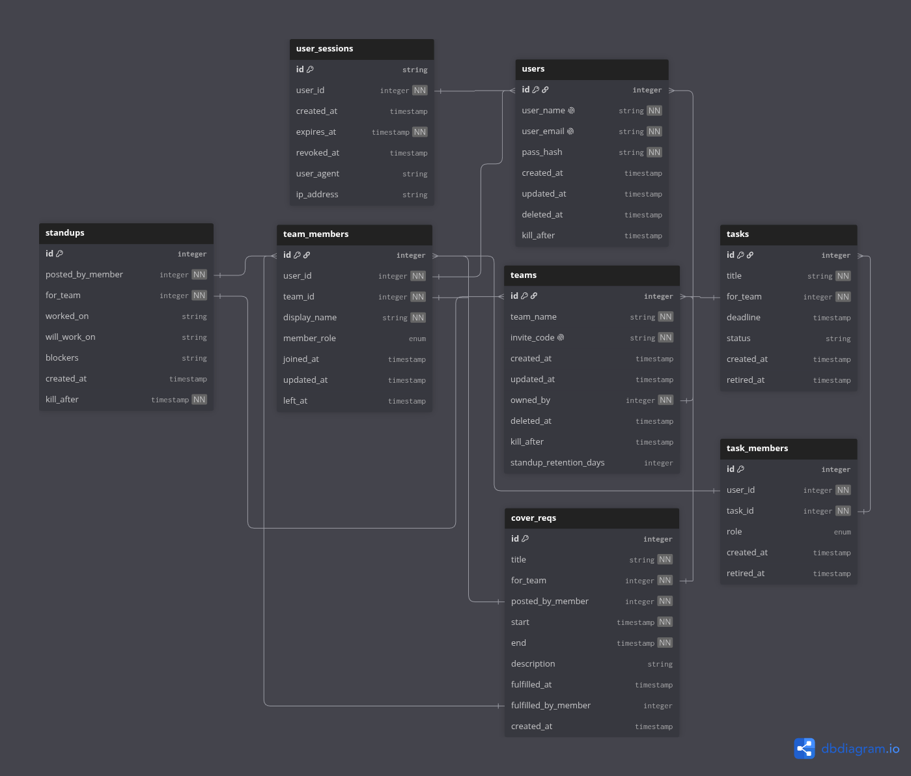

# Database

## OVERVIEW

This database is designed to store all server-side information including login credentials, authentication sessions, team information, user team profiles, and user-generated content.

## ARCHITECTURE

### Backend Usage and Data Flow

#### Frontend

Let the frontend serve purely as a messenger of inputs given to and a displayer of pretty pre-formatted shapes received from API calls. This is not the kind of program that requires heavy client-side work.

#### API

Parse frontend requests and validate input. Return HTTP responses. Call into the service layer.

#### Service

Handle authorization, enforce permissions, works data between repos. A lot of logic and the main security layer.

#### Data Respositories

Database access occurs here only. Pure CRUD operations. Migrating between frameworks should only require work at this layer.

#### Storage

JSON files, Postgres databases, etc.

---

### Technologies/Tools

Uncertain; most likely reading/writing flat JSON files from backend

### Dependencies

Uncertain; most likely none if we go with flat JSON files

### Authentication/Session Storage Considerations

User sessions will be stored in the **Sessions** table with reference to a user id, ip address, and user agent. Sessions are created on successful login and can be set to expire after some amount of time, which will require that user to log in again.

### Scaling/Extension Considerations

Schema and backend must be designed to facilitate migration between databse setups (i.e. JSON reading -> Postgre).

---

## SCHEMA

### Schema Model

**[NOT AN IMPLEMENTATION]** [schema_model.txt](./db/schema_model.txt)

### Tables

**\_meta** - current database version and last update.

**Users** - persistent user info for login authentication and account management. Modeled to support a soft-to-hard deletion scheme; user can delete their account after which it will be soft-deleted and remain in a read-only state for some amount of time, after which it will be hard-deleted from the database and, to preserve privacy, all activity associated with that account will also be deleted. Accounts may be recovered any time before hard deletion.

**Sessions** - user authentication sessions, attached to user id, ip address, and user agent. Set to expire after some length of time, requiring new login.

**Teams** - surface-level team info and team management. Teams may be soft-to-hard deleted in the same manner as users and recovered while soft-deleted.

**Team Members** - team-level user profiles, similar to Slack/Discord server profiles. User activity may persist on a team after they left and while soft deleted, but will be deleted if the user account is hard deleted.

**Check ins** - check-ins posted per project that include stand up, blockers, and current mood. Assuming user will post all three at once, if we want to display stand-ups, blockers, and mood separately, they can be derived from this table.

**Projects** - projects associated with a certain team, encompasses several tasks and project members. Can have an optional status and deadline, and may be archived and unarchived or hard-deleted from database. May have a leader assigned to it.

**Project Members** - a subset of team members; team members associated with a project who may leave or rejoin a project while preserving their activity in said project (activity will be removed on account hard deletion).

**Tasks** - associated with projects. May have a deadline and/or status attached and may be deactivated/reactivated or hard-deleted.

**Task Members** - a subset of project members; project members associated with a task who may assign or unassign themselves to said task while presving activity (activity will be removed on hard account deletion).

**Cover Requests** - associated with a team member and a project. Can be given a modifiable start and end date, but will be hard-deleted after the end date has been passed. Can also be hard-deleted anytime prior by poster of cover request or a project administrator.

### Relationships

Sessions <- Users

Teams <- Users
 
Teams -> Projects <- Team Members
 
Tasks <- Projects

Users -> Team Members <- Teams
 
Team Members -> Project Members <- Projects
 
Project Members -> Task Members <- Tasks

Team Members -> Check-Ins <- Projects
 
Team Members -> Cover Requests <- Projects

### Constraints

- User details are for authentication; in practice users should only see each other's team-specific **Team Member** details
- Teams own projects, projects own tasks; do not skip the hierarchy
- Hard-deletion is true deletion; any hard-deleted info is unrecoverable
- Store all timestamps in UTC for uniformity; only convert to local time when reading to client
- Soft-deleted/archived rows are strictly read-only unless reactivated
- On hard deletion, all dependents of the deleted row (such as team members from a user) are also deleted and will no longer be referenced; hard account/team deletion is a privacy measure, so the removal of information associated with an individual or organization takes priority

### Completion

First draft: v0.1

### To do

Based on our "musts":

- [x] Users
- [x] Team memberships
- [x] Teams
- [x] Check-ins (standups + mood)
- [x] Blockers
- [x] Cover requests
- [ ] Meeting scheduler (not sure exactly how this is gonna be done)
- [ ] Something something AI (if we get to it)

---

- [x] Relationships between users and teams
- [x] Relationships between teams and projects
- [x] Relationships between team members and projects
- [x] Relationships between projects and tasks
- [x] Relationships between team members and tasks
- [x] Relationships between projects and check-ins/cover reqs
- [x] Relationships between team members and check-ins/cover reqs

### Visualization/Modification

Paste the contents of wip-schema.txt into the code editor at dbdiagram.io. Changes will be saved locally to your dbdiagram account. Once you are ready to commit any changes you made, simply overwrite the current contents of wip-schema.txt. Sharing the project directly is a "pro" feature so this is the workaround we have to use. If you would like to propose a better methodology please do so.
