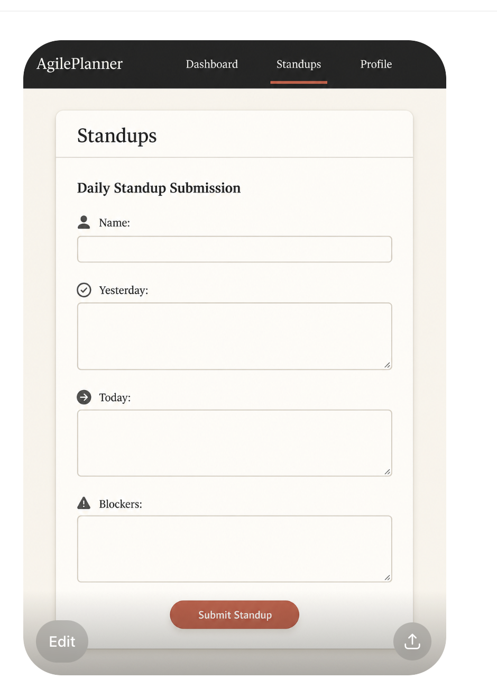

# Overview of the application’s visual direction

- Clean, minimal design
- The intended look should be simple, clean, and professional

# Descriptions of all planned pages/tabs

Daily StandUp Tab - Contains the sections where members can do a standup report. There are three core questions in the stand up, asking the members what they did yesterday, what they will do today, and identifying any obstacles.
Through this, submitting standups allows members to update their team members on their progress while addressing their next steps.
Team Board - Have a list of members and their roles (can implement a fake team with list for this) and an add member button.
Task Tab - Have a "create task" button that when clicked results in a popup text field to type in the task name. There is also a submit button to submit the task.
Blockers Tab - Almost identical to tasks. Have an "add blocker" button that results in a text field popup to type in a blocker with a submit button to submit the blocker.
**All tabs should be on different pages** make sure the underline at the top of the page moves under the tab the user is on when a new tab is clicked.
**get rid of archives tab**

# Navigation flow

- Easy to navigate, all features should be easy to locate from any part of the website
- Navbar at the top with all tabs, pinned to the top of the screen
  - Prefer top bar instead of side bar

# Proposed layouts and interface structure

| UI Element                      | Color                   |       Hex       |
| ------------------------------- | ----------------------- | :-------------: |
| Navbar background               | Dark charcoal           |     #252525     |
| Main page background            | Warm cream              |     #F3EEE6     |
| Form card background            | Soft ivory              |     #FAF8F5     |
| Primary text                    | Dark gray               |     #2F2F2F     |
| Input borders                   | Light beige/taupe       |     #D8CFC2     |
| Active tab underline            | Muted red               |     #D66A59     |
| Submit button                   | Terracotta              |     #D5644F     |
| Submit button darker edge/hover | Deep terracotta         |     #BE5242     |
| Shadow color                    | Soft black transparency | rgba(0,0,0,.08) |

# Color/theme recommendations

- Sri’s prototype has a good general vibe and color scheme
  - Sharp edges, dark borders
    - Don’t like the “AI” vibe of rounded corners
  - Not basic but also not too flashy and unprofessional
- Use colors to signify meaning
  - Red to indicate blockers
  - Color coding for task status

# Notes on usability and accessibility

- Options to toggle between light and dark mode would be nice
- Website should be intuitive and easy to navigate
  - “Paula” should be able to use it easily

# Example mockups or wireframes (if available)

